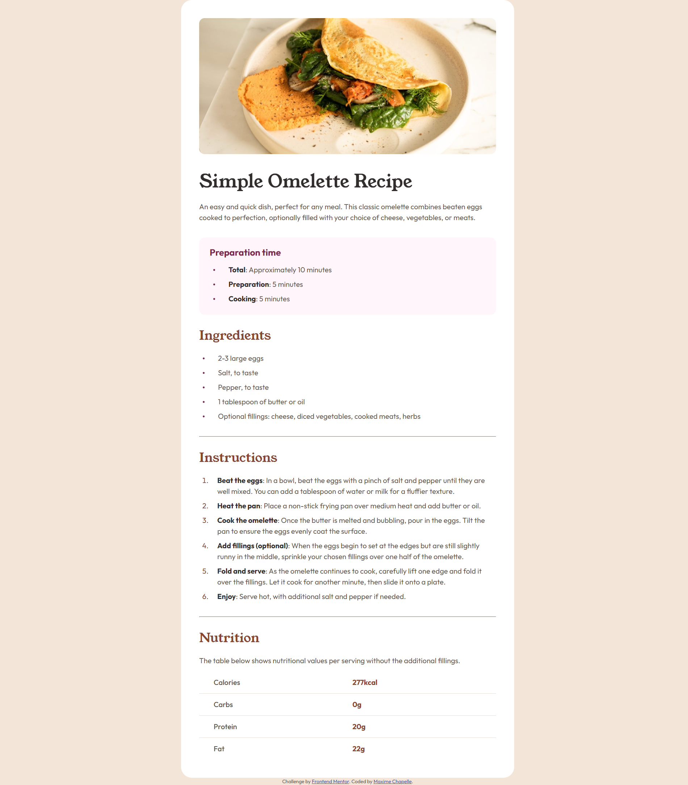

# Frontend Mentor - Recipe page solution

This is a solution to the [Recipe page challenge on Frontend Mentor](https://www.frontendmentor.io/challenges/recipe-page-KiTsR8QQKm).

## Table of contents

- [Overview](#overview)
  - [Screenshot](#screenshot)
  - [Links](#links)
- [My process](#my-process)
  - [Built with](#built-with)
  - [What I learned](#what-i-learned)
  - [Continued development](#continued-development)
  - [Useful resources](#useful-resources)
  - [AI Collaboration](#ai-collaboration)
- [Author](#author)
- [Acknowledgments](#acknowledgments)

## Overview

A responsive recipe page built from scratch with semantic HTML and CSS.

### Screenshot



### Links

- Solution URL: [Add solution URL here](https://your-solution-url.com)
- Live Site URL: [Add live site URL here](https://your-live-site-url.com)

## My process

### Built with

- Semantic HTML5 markup
- CSS custom properties
- Flexbox
- Mobile-first workflow
- Local fonts via `@font-face`
- `clamp()` for responsive typography

### What I learned

This project taught me a lot of small but important CSS details.

Using `width: 100%` instead of fixed widths lets the screen dictate the size:

```css
article {
    width: 100%;
    max-width: 46rem;
}
```

`display: block` on images removes the ghost space below them:

```css
img {
    display: block;
}
```

`flex-shrink: 0` prevents pseudo-elements from deforming inside a flex container:

```css
.recipe-list li::before {
    flex-shrink: 0;
    width: 4px;
    height: 4px;
    border-radius: 50%;
}
```

`clamp()` for responsive typography without media queries:

```css
h1 {
    font-size: clamp(2.25rem, 2vw, 2.5rem);
}
```

`border-collapse: collapse` + `border-bottom` on `td`/`th` for clean table separators:

```css
table {
    border-collapse: collapse;
}

td, th {
    border-bottom: 1px solid var(--color-stone-150);
}
```

### Continued development

Still a lot to practice — pseudo-elements, responsive units, and I want to start digging into CSS Grid. Accessibility with ARIA is also on my list.

### Useful resources

- [MDN Web Docs](https://developer.mozilla.org) - My go-to reference for CSS properties and HTML elements.
- [Figma](https://figma.com) - Used to extract design values and compare my work against the mockup.

### AI Collaboration

I worked with Claude throughout the project. It never gave me direct answers — it asked questions and made me figure things out myself, which was sometimes frustrating but always useful. It also suggested things I wouldn't have thought of alone: `flex-shrink: 0` to prevent pseudo-elements from deforming, `display: block` on images to kill the ghost space below them, and the difference between `::before` and `::marker`. Honestly a solid way to learn — or at least I hope so.

## Author

- Frontend Mentor - [@maxi1993-tech](https://www.frontendmentor.io/profile/maxi1993-tech)
- GitHub - [maxi1993-tech](https://github.com/maxi1993-tech)

## Acknowledgments

Thanks to Frontend Mentor for providing well-designed challenges that make practicing HTML and CSS actually enjoyable.